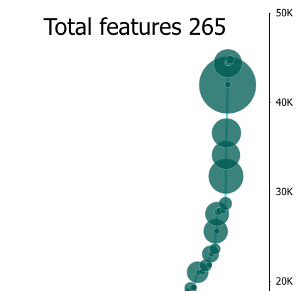

# GlobeMap
[Coverage Status](https://coveralls.io/repos/github/Microsoft/powerbi-visuals-globemap/badge.svg?branch=master)](https://coveralls.io/github/Microsoft/powerbi-visuals-globemap?branch=master)

> A 3D visual using WebGL for plotting locations, with category values displayed as bar heights and heat maps. Shift+Click on bar to change center point. Slicing data points will animate to average location. 

# Overview
Globe Map is a 3D Map that makes the map exploration experience more immersive and magical. It provide the sense of connection to the data with the physical world. This, combined with our spatial ability, brings a new perspective to the data when presented as 3D objects.

Use it with any location data. The location could be an address, city, county , state/province or country/region. On this 3D map, you can project a measure as the height of the bar. The 3D bars reduce the clutter of overlapping bubbles and allow you to get instant insight. GlobeMap also allows you to rotate the Globe and see it from different angles.

Globe Map also supports heat map on the spatial map. You can use a second measure for heat intensity and draw immediate attention to the right areas.

See also [Globe Map at Microsoft AppStore](https://appsource.microsoft.com/en-us/product/power-bi-visuals/WA104380799)